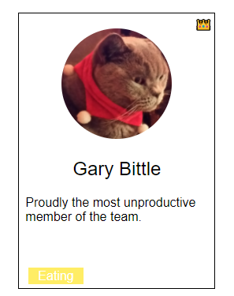
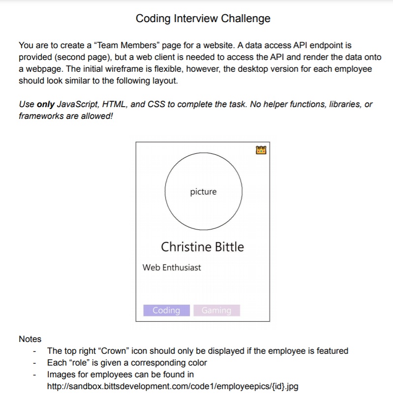

<!-- PROJECT LOGO -->
 

  

  <h3 align="center">Interview Coding Challenge</h3>

  

    An example of a coding challenge that one might be asked to do as part of a job application.
  

<!-- TABLE OF CONTENTS -->

  
<h2 style="display: inline-block">Table of Contents</h2>

  <ol>
    <li><a href="#about">About</a></li>
    <li><a href="#requirements">Requirements</a></li>
    <li><a href="#reflection-questions">Reflection Questions</a></li>
    <li><a href="#acknowledgements">Acknowledgements</a></li>
  </ol>

<!-- ABOUT THE PROJECT -->
## About

This is an screenshot of the first page of the pdf that described the challenge:   
 

## Requirements

Gleaned from the pdf:
<ul>
  <li>Single page website.</li>
  <li>Title: Team Members</li>
  <li>Panel for each member should look like moockup.</li>
  <li>Panel details:
    <ul>
      <li>Crown for featured employee.</li>
      <li>Each role should have a different colour.</li>
      <li>Circle-cropped image.</li>
      <li>Name as heading.</li>
      <li>Bio below name.</li>
      <li>Roles at the bottom.</li>
    </ul>
  </li>
  <li>Vanilla js, html, and css.</li>
  <li>End points suggest that the roles might be clickable, and lead to a second page with only employees with a given role.</li>
  <li>End points also suggest a page that allows the user to select multpile roles and show all employees with those roles.</li>
</ul>

## Reflection Questions

* What are your initial thoughts of the Coding Interview Challenge?
* What's your plan to approach it?
* How long do you imagine each step taking?
* What ended up being the actual process vs. your planned process?
* What could you do to improve?

My initial thoughts are that it seems quite involved. I understand the need to evaluate the abilities of a job candidate, but anything that would take more than 2-3 hours seems a bit excessive. I would only give this much of my time to an interview challenge if it was my ultimate dream job.

My approach will be roughly this:

<ol>
  <li>Determine requirements.</li>
  <li>Set up some code so that I can access the API and get a look at the available data.</li>
  <li>Static html and css.</li>
  <li>JS to dynamically render repeating elements.</li>
  <li>Testing.</li>
  <li>Documentation.
  <li>Additional features, depending on time.</li>
</ol>

Time estimates:
<ol>
  <li>Requirements: 1 hour</li>
  <li>API and data: 2 hours</li>
  <li>Html and css: 2 hours</li>
  <li>JS: 2 hours</li>
  <li>Testing: 1 hour</li>
  <li>Documentation: .5 hours</li>
</ol>

Total: 8.5 hours

Actual time:
<ol>
  <li>Requirements: .5 hours</li>
  <li>API and data: 2 hours</li>
  <li>Html and css: 1.25 hours</li>
  <li>JS: 1 hour</li>
  <li>Testing: .25 hours</li>
  <li>Documentation: .5 hours</li>
</ol>

Total: 5.5 hours

My process ended up following my plan pretty closely, except that I had done the work investigating the API before determining my requirements, which led me to think that the challenge was more difficult than it really was. If I had assessed the requirements first, it probably would have taken only 3-4 hours, which is significantly more reasonable for an interview challenge. 

In the end, I only needed two of the endpoints to complete the challenge, but I wrote code to support all of them, so that was work I didn't have to do. However, if I wanted to impress an employer and add extra features, some of that work would come in handy.

<!-- ACKNOWLEDGEMENTS -->
## Acknowledgements

* [Christine Bittle](https://www.linkedin.com/in/christinebittle/?originalSubdomain=ca)
